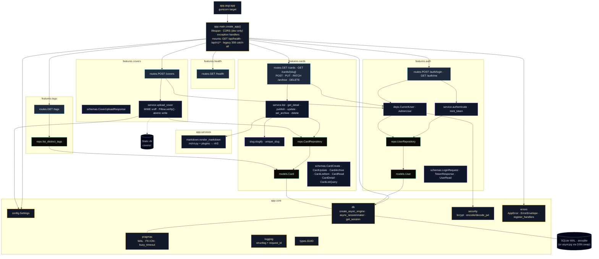
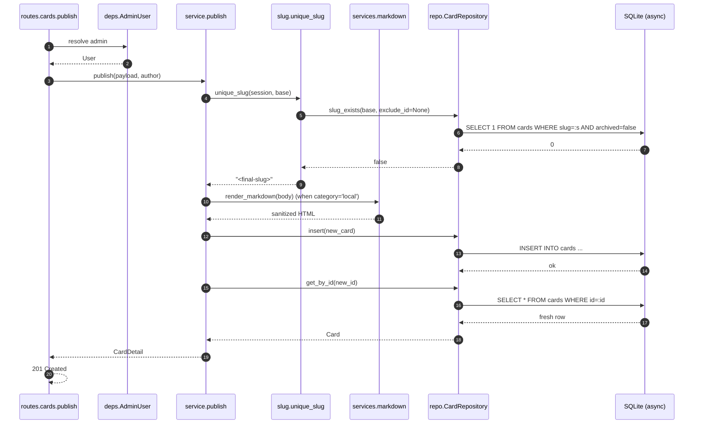
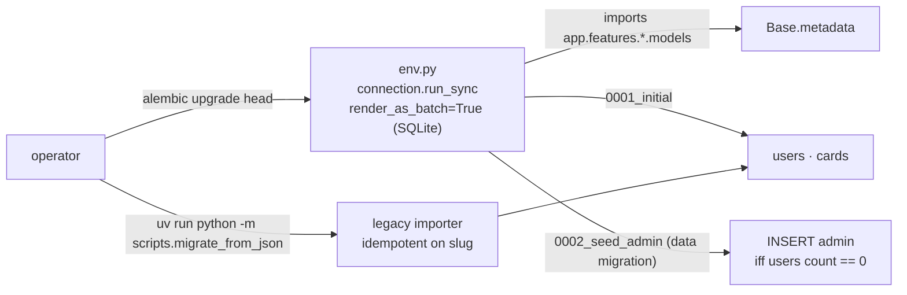

# Backend modules

Feature-modular vertical slices on top of `core/` plumbing. Routers wire DI and call services; services own logic and call repositories; repositories own all SQL. The pattern is uniform across `auth`, `cards`, `covers`, `tags`, and `health`.

## Tree

## Layers and rules

| Layer | Owns | Imports allowed | Forbidden |
|---|---|---|---|
| `routes.py` | HTTP wiring, DI, schema validation | `service.py`, `deps.py`, `schemas.py` | SQL, business logic, ORM models |
| `service.py` | Business logic, orchestration, error raising | `repo.py`, `services/*`, `core/*`, `schemas.py` | SQL, FastAPI imports |
| `repo.py` | All SQL, ORM access | `models.py`, `sqlalchemy` | Pydantic, FastAPI, business rules |
| `models.py` | ORM tables + relationships | `core.db`, `core.types`, `sqlalchemy` | Pydantic, services |
| `schemas.py` | Pydantic request/response shapes | `pydantic`, type aliases | ORM, SQL |
| `core/*` | Cross-cutting plumbing | each other (acyclic) | features |
| `services/*` | Pure helpers (e.g. markdown) | stdlib + libs | features, DB, FastAPI |

Routers cap at ~30 LOC each. Anything heavier moves into the service.

## Write path (cards.publish)

## Migration

