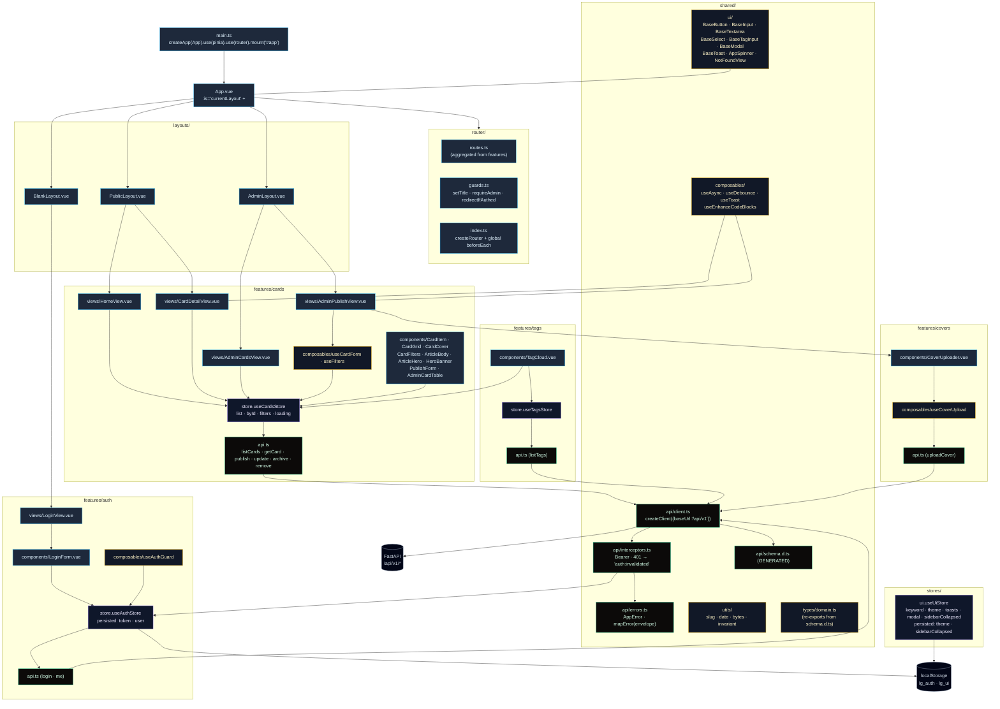
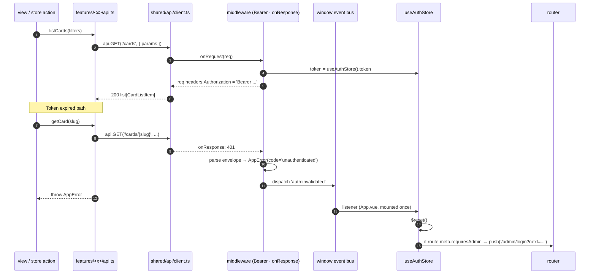
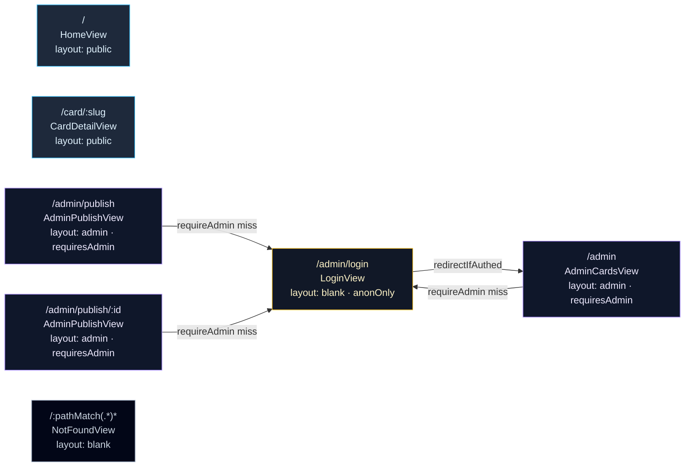

# Frontend modules

Feature-modular slices on top of a shared kit. Views call per-feature `api.ts` wrappers; wrappers call the typed `openapi-fetch` client. Pinia setup stores live next to their feature; only `auth` and `ui` persist via `pinia-plugin-persistedstate`.

## Tree

## Layered rules

| Layer | Owns | Imports allowed | Forbidden |
|---|---|---|---|
| `views/` | Page composition, route data fetch | feature `api.ts`, feature stores, components, composables | global stores, direct `api` client |
| `components/` | Reusable visuals; emit events, accept props | shared/ui, shared/composables | feature stores (use props/emits instead) |
| `features/<x>/api.ts` | Typed thin wrappers around `openapi-fetch` | `shared/api/client` | other features' APIs |
| `features/<x>/store.ts` | Pinia setup store; mutations via actions | feature `api.ts`, `shared/api/errors` | DOM, router |
| `shared/api/*` | API client + interceptors + AppError | `openapi-fetch`, generated `schema.d.ts` | features |
| `shared/composables/*` | Reusable composables | Vue runtime, `@vueuse/core` | feature stores |
| `shared/ui/*` | Base primitives | Vue runtime | feature stores, API |
| `router/*` | Route table + guards | layouts, lazy view imports | feature stores at module scope (use guard fn) |

## API client middleware

## Routes + guards

