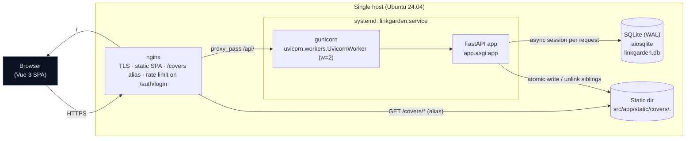
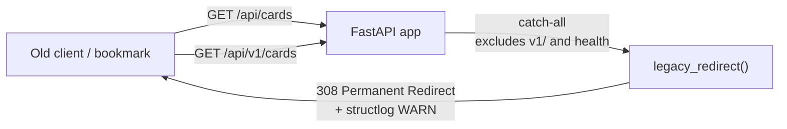

# System context

Single-host deployment. The browser talks to nginx; nginx serves the SPA from `dist/`, proxies `/api/` to the FastAPI app on `127.0.0.1:5001`, and `alias`-serves `/covers/` directly off disk. The app uses an async SQLAlchemy session per request against SQLite (WAL mode) in dev/prod, or PostgreSQL via a `DATABASE_URL` swap.



## Request shapes

```mermaid
sequenceDiagram
    autonumber
    participant B as Browser
    participant N as nginx
    participant G as gunicorn+uvicorn
    participant A as FastAPI app
    participant D as SQLite

    B->>N: GET /api/v1/cards
    N->>G: proxy_pass http://127.0.0.1:5001
    G->>A: ASGI request
    A->>D: SELECT cards WHERE archived=false ORDER BY created_at DESC
    D-->>A: rows
    A-->>G: 200 JSON list[CardListItem]
    G-->>N: 200
    N-->>B: 200 (HTTPS)

    B->>N: POST /api/v1/auth/login (rate-limited 10r/m)
    N->>G: proxy_pass
    G->>A: LoginRequest
    A->>D: SELECT user WHERE username=:u
    A-->>G: 200 TokenResponse (JWT HS256, 12h TTL)
    G-->>N: 200
    N-->>B: 200

    B->>N: POST /api/v1/covers (multipart, Bearer)
    N->>G: client_max_body_size 6m
    G->>A: Form(card_id) + UploadFile
    A->>A: MIME sniff · size · Pillow.verify() · dims
    A->>+D: BEGIN
    A->>D: UPDATE cards SET cover=...
    A->>A: atomic write .tmp + os.replace; unlink old-ext siblings
    A->>-D: COMMIT
    A-->>G: 201 CoverUploadResponse
```

## Legacy `/api/*` shim


